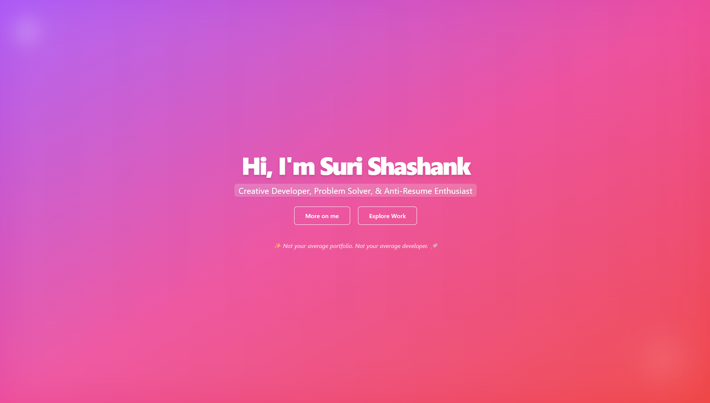
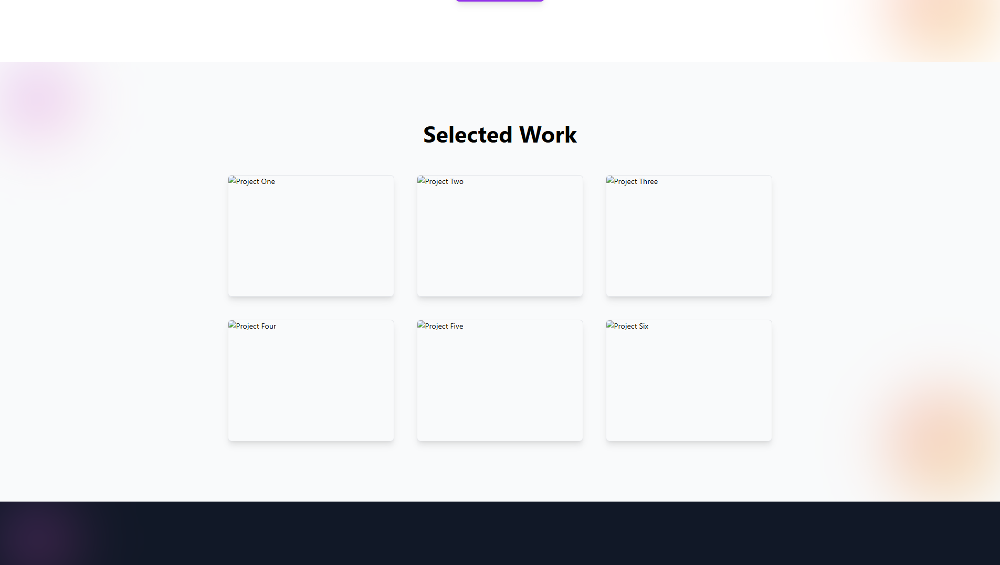

# Suri Shashank Portfolio

A modern, minimal, and dynamic personal portfolio website built using the **MERN stack**. It showcases my projects, skills, experience, and contact details in a sleek and responsive UI built with **React**, **Tailwind CSS**, and **Framer Motion**.

🌐 [View Live](https://notyetbruhlol.vercel.app)




---

## ✨ Features

- Responsive, animated hero section with gradient backgrounds and glassmorphism
- Floating, interactive navbar with dark/light theme toggle (always visible)
- Animated, blurred background blobs that follow the mouse and show through sections
- Smooth scroll navigation between sections
- Animated sections: About, Skills, Timeline, Projects, Certificates, Contact
- Dark mode support (toggle in top-right corner)
- Contact form with social links (LinkedIn, GitHub, X, Gmail, etc.)
- Clean, minimal, and modern UI
- Timeline and Projects are linked: clicking a timeline project scrolls to the project card
- Certificates and resume are served dynamically from the backend

---

## 🚀 Getting Started

### Prerequisites

- [Node.js](https://nodejs.org/) (v16+ recommended)
- [npm](https://www.npmjs.com/) or [yarn](https://yarnpkg.com/)

### Installation

1. **Clone the repository:**
   ```bash
   git clone https://github.com/yourusername/your-portfolio.git
   cd your-portfolio
   ```

2. **Install dependencies:**
   ```bash
   npm install
   # or
   yarn install
   ```

3. **Start the development server:**
   ```bash
   npm start
   # or
   yarn start
   ```

4. **Open in your browser:**
   ```
   http://localhost:3000
   ```

---

## 🛠️ Tech Stack

- **React** – UI library
- **Tailwind CSS** – Utility-first CSS framework
- **Framer Motion** – Animations and transitions
- **GSAP** – Scroll and reveal animations
- **Express/MongoDB** – (Optional, for backend/contact form and dynamic certificates)

---

## 🌗 Dark Mode

- Toggle dark/light theme using the button at the top right.
- Theme is applied globally using Tailwind’s `dark` class.

---

## 📁 Project Structure

```
src/
  components/
    Hero.js
    Navbar.js
    About.js
    Skills.js
    Timeline.js
    Projects.js
    Certificates.js
    Contact.js
  App.js
  index.js
  ...
```

---

## ✏️ Customization

- **Edit your info:**  
  Update your details, project data, and social links in the respective components.
- **Change colors:**  
  Tweak Tailwind classes for your preferred color palette.
- **Add sections:**  
  Duplicate and modify components as needed.
- **Serve your certificates/resume:**  
  Place your files in the backend/static folder and update the API endpoints.

---

## 📦 Build

To create a production build:
```bash
npm run build
# or
yarn build
```

---

## 📝 License

MIT License

---

**Made by Suri Shashank**  
👤 Suri Shashank  
🔗 [LinkedIn](https://www.linkedin.com/in/surishashank)  
📫 shashank.suri616@gmail.com